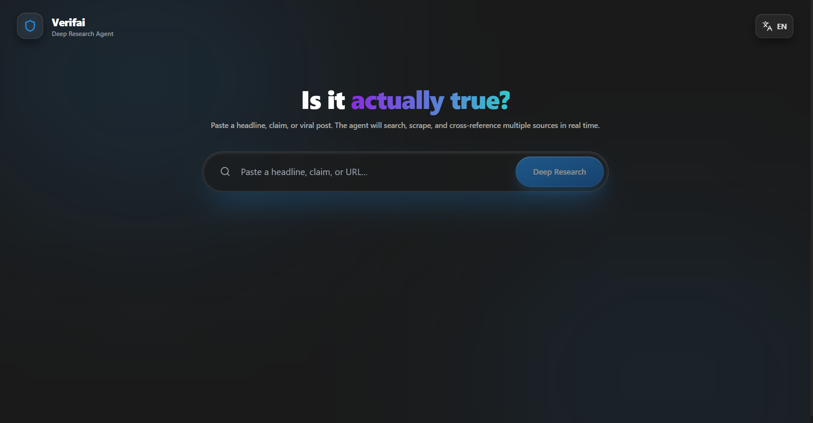

<div align="center">


# Verifai

### Truth, with receipts.

Real-time claim verification powered by autonomous web research and fast LLM reasoning.
</div>

---

## Why Verifai

Misinformation moves fast. Verification should move faster.

**Verifai** helps users validate claims with:
- grounded evidence from live web sources,
- clear, structured reasoning, and
- a secure architecture that keeps API keys off the client.

Whether you are a student, researcher, journalist, or a curious reader, Verifai is designed to turn "Is this true?" into an auditable answer.

## Highlights

- **Live evidence retrieval** via Tavily and Jina-backed research flows.
- **Fast analysis engine** using Groq-hosted Llama models for low-latency responses.
- **Streaming experience** so users can follow verification progress in real time.
- **Polished interface** with React and Framer Motion for a modern, fluid UX.
- **Exportable reports** generated as PDFs for sharing and documentation.
- **Security-first by default** through a server-side verification proxy.

## How It Works

1. User submits a claim in the frontend app.
2. The app calls a secure backend endpoint (`/api/verify.js`).
3. The backend orchestrates source search + content retrieval.
4. The LLM evaluates sources and generates a reasoned verdict.
5. Results stream back to the UI and can be exported as a report.

## Tech Stack

- **Frontend:** React 19, Vite, TypeScript
- **UI/UX:** Framer Motion, Lucide React, utility-first styling helpers
- **Backend:** Vercel Serverless Functions
- **AI & Research:** Groq API, Tavily API, Jina API
- **Document Export:** jsPDF, jspdf-autotable
- **Localization:** i18next, react-i18next

## Security Architecture

Verifai follows a simple rule: **secrets never ship to the browser**.

All provider calls (Groq, Tavily, Jina) are routed through backend functions. The frontend only communicates with trusted server endpoints, which means API keys remain protected and out of client bundles.

## Getting Started

### Prerequisites

- Node.js 18+
- npm
- API keys for Groq, Tavily, and Jina

### 1) Install dependencies

```bash
npm install
```

### 2) Configure environment variables

Create `.env.local` in the project root:

```env
GROQ_API_KEY=your_groq_api_key
TAVILY_API_KEY=your_tavily_api_key
JINA_API_KEY=your_jina_api_key
```

You can also copy values from `.env.example` and fill them in.

### 3) Run the app locally

```bash
npm run dev
```

Open `http://localhost:5173`.

## Available Scripts

- `npm run dev` - start local development server
- `npm run build` - create production build
- `npm run preview` - preview production build locally

## Roadmap

- Multi-modal verification (images/video)
- Browser extension for in-page claim checks
- Human-in-the-loop review and consensus signals
- Source credibility scoring and explainability upgrades

---

<div align="center">
Built for clarity, accountability, and trustworthy information.
</div>
